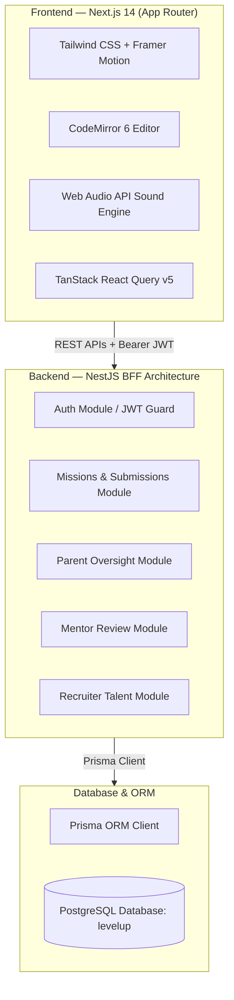

# LevelUp — Comprehensive MVP Development & Architecture Document

---

## 1. Executive Summary

**LevelUp** is an industry-standard gamified learn-by-doing developer platform created to bridge the transition gap for 18–24 year-olds finishing or dropping out of traditional education. 

Instead of passive video lectures and static certificate PDFs that fail to prove competence, LevelUp creates a daily mission loop that outputs **100% verified, runnable sandbox portfolios** reviewed by industry mentors, tracked by parents, and scouted by tech recruiters.

---

## 2. System Architecture & Tech Stack



| Layer | Technology | Rationale |
| :--- | :--- | :--- |
| **Frontend Framework** | **Next.js 14 (App Router) + React 18** | SSR & routing out of the box, optimal SEO for public portfolios |
| **Styling & Motion** | **Tailwind CSS + Framer Motion** | Fast utility styling, responsive layouts, smooth micro-interactions |
| **Code Editor** | **CodeMirror 6 (One Dark Theme)** | Syntax highlighting for HTML, CSS, JS; lightweight bundle |
| **Audio Engine** | **Native Web Audio API** | Zero-dependency sound effects (dings, chords, taps, XP chimes) |
| **Backend Framework** | **NestJS 10 (Node.js + TypeScript)** | Modular BFF architecture with dependency injection and DTO guards |
| **ORM & Database** | **Prisma 5 + PostgreSQL** | Relational integrity across students, parents, mentors, and recruiters |
| **Authentication** | **Passport JWT + bcryptjs** | Role-based token authentication (`STUDENT`, `PARENT`, `MENTOR`, `RECRUITER`) |

---

## 3. Core Gamified Learning Loop

### 3.1 Onboarding & Career Roadmap
1. **Swipe-based Career Quiz (`/quiz`)**:
   - 5 interactive assessment questions analyzing student preferences (e.g. visual UI, backend systems, mobile apps, design).
   - Animates cards with agreement/disagreement metrics to match candidates into one of 5 Career Tracks:
     - *Frontend Web Development*
     - *Backend Development*
     - *Full-Stack Development*
     - *Mobile App Development*
     - *UX/UI Design*
2. **AI-Generated Roadmap (`/roadmap`)**:
   - Renders a step-by-step milestone path of courses tailored to the student's selected track.

### 3.2 Student Game Dashboard (`/dashboard`)
- **Real-Time Game Stats**: Current Level, Learning Streak (with fire badge), and Accumulated XP.
- **Track Progress Indicator**: Circular velocity progress bar showing track completion percentage.
- **Active Missions Queue**: "Up Next" mission cards featuring course name, XP reward, and instant launch button.
- **Recent Activity Feed**: Historical log of completed missions and review statuses.

### 3.3 Duolingo-Style Mission Workspace (`/mission/[id]`)
- **Step-by-Step Progressive Guidance**: Each mission is decomposed into 3–5 bite-sized interactive steps. Only the active step is unlocked; subsequent steps remain locked until prerequisites are met.
- **Real-Time Auto-Validation**: As the student types in CodeMirror, DOM checking validates their code live. Once correct, the step automatically completes.
- **Tab-to-Fill Assistance**: A "Fill Code" button allows learners to auto-insert the step's expected solution into the correct tab, preventing friction.
- **Hint System**: Toggleable lightbulb hints with exact code snippets.
- **Web Audio Sound Effects**:
  - *Step Complete*: Ascending 3-tone ding (A5-C#6-E6).
  - *Mission Complete*: Celebratory multi-tone major chord.
  - *XP Boost*: Rising harmonic chime.
- **Celebration Visuals**:
  - CSS confetti particle system bursting across the screen.
  - Floating `+10 XP` popup animation.
  - Full-screen "Mission Complete" modal overlay with celebration trophy.
- **Sandboxed Live Output**: Debounced (500ms) multi-language compilation rendering HTML, CSS, and JS simultaneously inside an iframe.

---

## 4. The Four Ecosystem Portals

LevelUp integrates four interconnected portals to connect education with real-world hiring:

### 4.1 🌐 Student Experience & Public Portfolio (`/dashboard`, `/mentorship`, `/mission/[id]`, `/portfolio/[id]`)
- **Direct Student-to-Mentor Guidance (`/mentorship`)**: Dedicated discussion hub connecting students directly with verified staff mentors (Elena Rostova). Includes live discussion threads, auto-attached code snippets, step-by-step references, copyable code, and resolution status toggles.
- **In-Workspace "Ask Mentor" Slide-Over Drawer**: Available right inside `/mission/[id]`. Auto-attaches current editor code and active step context so students never get stuck.
- **Family Cheer Feed**: Highlights motivational messages and +15 XP boosts sent from parents directly onto the Student Dashboard.
- **Verified Public Showcase**: No login required — accessible to anyone with the link, showing runnable sandboxed projects and mentor commendations.

### 4.2 👨‍👩‍👧 Parent Portal (`/parent`)
*Empowering parents to support their children through quantifiable progress and complete communication transparency.*

- **Mentor Communications & Safety Oversight Tab**: Full oversight audit feed allowing parents to read every exchange between their child and mentors, including questions asked, code snippets, and mentors' educational advice.
- **Verified Safe Mentoring Guarantee**: Safety compliance indicators and verified certified mentor credentials.
- **Child Learning Insights**: Tracks estimated study hours, streak consistency, curriculum velocity, and recent submissions.
- **Interactive Encouragement & Cheers Hub**: Parents can choose preset encouragement templates or craft custom notes awarding a **+15 XP motivation boost** (persisted with history log).
- **Student Account Linking**: Modal to link student profiles by email.

### 4.3 👩‍🏫 Mentor Workbench (`/mentor`)
*Industry-standard code review hub, student Q&A center, and mentee roster.*

- **3-Tab Dual Workbench**:
  1. **Review Queue**: Split-screen code viewer (HTML/CSS/JS) and live sandboxed preview, 5-star rubric, quick feedback templates, and +35 XP endorsement.
  2. **Student Q&A & Inquiries Hub**: Dedicated inbox of all student questions across missions. Filter by `Needs Reply` / `Resolved`. Mentors reply with corrective code blocks and mark questions resolved.
  3. **Active Mentees Directory**: Roster of apprentices, their streaks, XP levels, blocker alerts, and a direct "Send Guidance" modal to reach out directly.
- **Mentor Statistics**: Tracks pending code submissions, open student inquiries needing reply, total evaluations, and average rating.

### 4.4 💼 Recruiter Portal (`/recruiter`)
*Candidate discovery network based on runnable proof-of-work.*

- **Talent Discovery Directory**: Real-time candidate search by name, keywords, or bio, with career track dropdown filters.
- **Candidate Snapshot Cards**: Displays verified level, total XP, streak days, verified project count, and skill pills.
- **Direct Portfolio Link**: One-click access to candidate's verified public portfolio.
- **Shortlist Bookmarking**: Bookmark candidates into an active hiring pipeline.
- **Interview Outreach Modal**: Form to dispatch official interview invitations with custom role titles and notes.

---

## 5. Database Schema (PostgreSQL + Prisma)

```prisma
datasource db {
  provider = "postgresql"
  url      = env("DATABASE_URL")
}

enum Role {
  STUDENT
  MENTOR
  PARENT
  RECRUITER
  ADMIN
}

enum SubmissionStatus {
  IN_PROGRESS
  SUBMITTED
  APPROVED
  REJECTED
}

model User {
  id                String            @id @default(cuid())
  email             String            @unique
  name              String
  passwordHash      String
  role              Role              @default(STUDENT)
  headline          String?           @default("Aspiring Software Engineer")
  bio               String?           @default("Learning by building real-world projects on LevelUp.")
  githubUrl         String?
  linkedinUrl       String?
  xp                Int               @default(0)
  level             Int               @default(1)
  streak            Int               @default(0)
  avatarUrl         String?
  quizCompleted     Boolean           @default(false)
  createdAt         DateTime          @default(now())
  updatedAt         DateTime          @updatedAt

  quizResponse      QuizResponse?
  roadmap           UserRoadmap?
  submissions       Submission[]
  progress          UserMissionProgress[]
  parentLinks       ParentStudent[]   @relation("StudentLink")
  childLinks        ParentStudent[]   @relation("ParentLink")
  reviewsGiven      Review[]          @relation("MentorReviews")
  savedByRecruiters SavedCandidate[]  @relation("CandidateSaved")
  recruiterSaved    SavedCandidate[]  @relation("RecruiterBookmarks")
}

model ParentStudent {
  id        String   @id @default(cuid())
  parentId  String
  studentId String
  createdAt DateTime @default(now())

  parent    User     @relation("ParentLink", fields: [parentId], references: [id])
  student   User     @relation("StudentLink", fields: [studentId], references: [id])

  @@unique([parentId, studentId])
}

model Review {
  id           String     @id @default(cuid())
  submissionId String
  mentorId     String
  feedback     String
  rating       Int        @default(5)
  createdAt    DateTime   @default(now())

  submission   Submission @relation(fields: [submissionId], references: [id])
  mentor       User       @relation("MentorReviews", fields: [mentorId], references: [id])
}

model SavedCandidate {
  id          String   @id @default(cuid())
  recruiterId String
  studentId   String
  notes       String?  @default("")
  createdAt   DateTime @default(now())

  recruiter   User     @relation("RecruiterBookmarks", fields: [recruiterId], references: [id])
  student     User     @relation("CandidateSaved", fields: [studentId], references: [id])

  @@unique([recruiterId, studentId])
}

model CareerTrack {
  id          String         @id @default(cuid())
  name        String         @unique
  description String
  icon        String?
  color       String?
  createdAt   DateTime       @default(now())

  courses     Course[]
  roadmaps    UserRoadmap[]
  quizResults QuizResponse[]
}

model Course {
  id            String      @id @default(cuid())
  careerTrackId String
  name          String
  description   String
  order         Int
  imageUrl      String?
  createdAt     DateTime    @default(now())

  careerTrack   CareerTrack @relation(fields: [careerTrackId], references: [id])
  missions      Mission[]
}

model Mission {
  id             String                @id @default(cuid())
  courseId       String
  title          String
  description    String
  instructions   String
  xpReward       Int                   @default(50)
  order          Int
  languages      String[]              @default(["html", "css", "js"])
  starterHtml    String                @default("")
  starterCss     String                @default("")
  starterJs      String                @default("")
  expectedOutput String?
  steps          Json                  @default("[]")
  createdAt      DateTime              @default(now())

  course         Course                @relation(fields: [courseId], references: [id])
  submissions    Submission[]
  progress       UserMissionProgress[]
}

model Submission {
  id          String           @id @default(cuid())
  userId      String
  missionId   String
  htmlCode    String           @default("")
  cssCode     String           @default("")
  jsCode      String           @default("")
  status      SubmissionStatus @default(IN_PROGRESS)
  xpEarned    Int              @default(0)
  submittedAt DateTime?
  createdAt   DateTime         @default(now())
  updatedAt   DateTime         @updatedAt

  user        User             @relation(fields: [userId], references: [id])
  mission     Mission          @relation(fields: [missionId], references: [id])
  reviews     Review[]

  @@unique([userId, missionId])
}
```

---

## 6. Complete API Reference

| Domain | Method | Endpoint | Auth | Description |
| :--- | :--- | :--- | :---: | :--- |
| **Auth** | `POST` | `/auth/register` | ❌ | Create new user account |
| **Auth** | `POST` | `/auth/login` | ❌ | Sign in and receive JWT token + user role |
| **Auth** | `GET` | `/auth/me` | ✅ | Get profile of currently authenticated user |
| **Public** | `GET` | `/users/public/:id` | ❌ | Retrieve verified public portfolio & projects |
| **Users** | `PATCH` | `/users/me` | ✅ | Update user bio, headline, GitHub, and LinkedIn |
| **Quiz** | `GET` | `/quiz/questions` | ❌ | Get 5 swipe assessment questions |
| **Quiz** | `POST` | `/quiz/submit` | ✅ | Submit quiz answers and assign career track |
| **Dashboard**| `GET` | `/dashboard` | ✅ | Fetch user stats, active missions, and velocity |
| **Missions** | `GET` | `/missions` | ✅ | List all courses and missions for student track |
| **Missions** | `GET` | `/missions/:id` | ✅ | Get mission details, starter code, and steps |
| **Submissions**| `POST` | `/submissions/autosave` | ✅ | Auto-save current HTML, CSS, JS code |
| **Submissions**| `POST` | `/submissions/submit` | ✅ | Complete mission and award student XP |
| **Portfolio** | `GET` | `/submissions/portfolio` | ✅ | List user's verified completed submissions |
| **Parent** | `GET` | `/parent/children` | ✅ | List linked children, study metrics, and reviews |
| **Parent** | `GET` | `/parent/children/:studentId/communications` | ✅ | Full parent oversight into mentor discussions & safety |
| **Parent** | `POST` | `/parent/link` | ✅ | Link a child account by email |
| **Parent** | `POST` | `/parent/cheer` | ✅ | Send motivational note with +15 XP reward (persisted) |
| **Mentor** | `GET` | `/mentor/queue` | ✅ | Get review queue (`SUBMITTED`, `APPROVED`, `ALL`) |
| **Mentor** | `POST` | `/mentor/review/:id` | ✅ | Submit rating, feedback, and approval/rejection |
| **Mentor** | `GET` | `/mentor/stats` | ✅ | Get metrics on reviews, mentees, and open inquiries |
| **Mentor** | `GET` | `/mentor/mentees` | ✅ | Get active mentee roster, status, and pending questions |
| **Mentorship** | `GET` | `/mentorship/threads` | ✅ | List threads (role-scoped for student, mentor, or parent) |
| **Mentorship** | `GET` | `/mentorship/threads/:id` | ✅ | Get thread details, messages, and code snippets |
| **Mentorship** | `POST` | `/mentorship/threads` | ✅ | Ask mentor a question with optional mission & code context |
| **Mentorship** | `POST` | `/mentorship/threads/:id/messages` | ✅ | Send reply in discussion thread (student or mentor) |
| **Mentorship** | `PATCH` | `/mentorship/threads/:id/status` | ✅ | Toggle status (`OPEN`, `RESOLVED`, `WAITING_ON_STUDENT`) |
| **Mentorship** | `GET` | `/mentorship/mentors` | ✅ | List verified available staff mentors |
| **Recruiter** | `GET` | `/recruiter/candidates` | ✅ | Search talent directory with track/query filters |
| **Recruiter** | `POST` | `/recruiter/bookmark/:id` | ✅ | Toggle saving candidate to shortlist |
| **Recruiter** | `GET` | `/recruiter/saved` | ✅ | Retrieve recruiter's saved talent shortlist |
| **Recruiter** | `POST` | `/recruiter/outreach/:id` | ✅ | Dispatch formal interview invitation |

---

## 7. Demo Accounts & Instant Role Switcher

The database is pre-seeded with realistic data representing every role. 

**Common Password for All Accounts**: `12345678`

| Role | Name | Email | Primary Route | Key Features to Test |
| :--- | :--- | :--- | :--- | :--- |
| **Student** | Alex Rivera | `student@levelup.com` | `/dashboard` | Duolingo workspace, +50 XP rewards, progress bar |
| **Top Student** | Sarah Chen | `sarah@levelup.com` | `/portfolio/[id]` | 14-day streak, verified HTML/CSS/JS projects |
| **Parent** | David Rivera | `parent@levelup.com` | `/parent` | Study hours, streak health, mentor reviews, +15 XP cheer |
| **Mentor** | Elena Rostova | `mentor@levelup.com` | `/mentor` | Split-screen workbench, 5-star rubric, +35 XP endorsement |
| **Recruiter** | Rachel Adams | `recruiter@levelup.com` | `/recruiter` | Candidate directory, filters, shortlist bookmarking, outreach |

> 💡 **Tip**: When logged into any portal, use the **1-Click Demo Role Switcher** in the bottom left of the sidebar to immediately switch between Student, Parent, Mentor, and Recruiter without manually logging out.

---

## 8. Development & Verification Guide

### Prerequisites
- Node.js 18+
- PostgreSQL server running on `localhost:5432` (user: `postgres`, password: `12345678`, database: `levelup`)

### Running the Backend
```bash
cd /Users/golapbarman/duniya_ai/backend
npm install
npx prisma generate
npx prisma migrate dev
npx prisma db seed
npm run start:dev
```
*Backend runs on: `http://localhost:4000`*

### Running the Frontend
```bash
cd /Users/golapbarman/duniya_ai/frontend
npm install
npm run dev
```
*Frontend runs on: `http://localhost:3000`*

---

## 9. File Structure Map

```
duniya_ai/
├── LEVELUP-DEVELOPMENT-SUMMARY.md     <-- Complete platform summary (this file)
├── README.md                          <-- Project onboarding guide
│
├── backend/                           <-- NestJS API Server
│   ├── prisma/
│   │   ├── schema.prisma              <-- Relational models & enums
│   │   └── seed.ts                    <-- Multi-role rich demo seeder
│   └── src/
│       ├── auth/                      <-- JWT, bcryptjs, Passport strategy
│       ├── users/                     <-- Profile management & public portfolio
│       ├── quiz/                      <-- Career quiz matching logic
│       ├── missions/                  <-- Step-by-step missions data
│       ├── submissions/               <-- Code compilation & autosave
│       ├── dashboard/                 <-- Game stats & velocity calculations
│       ├── parent/                    <-- Family oversight, cheering (+15 XP)
│       ├── mentor/                    <-- Code review workbench & endorsement (+35 XP)
│       ├── recruiter/                 <-- Candidate directory & outreach
│       ├── app.module.ts              <-- Central NestJS module registry
│       └── main.ts                    <-- CORS, validation pipes, port 4000
│
└── frontend/                          <-- Next.js 14 Web Application
    └── src/
        ├── app/
        │   ├── page.tsx               <-- Landing page with 4 ecosystem pillars
        │   ├── (auth)/                <-- /login and /signup pages
        │   ├── (app)/
        │   │   ├── dashboard/page.tsx <-- Student game dashboard
        │   │   ├── quiz/page.tsx      <-- Swipe-based career assessment
        │   │   ├── roadmap/page.tsx   <-- Dynamic career roadmap
        │   │   ├── mission/[id]/      <-- Duolingo-style workspace
        │   │   ├── portfolio/         <-- Internal student portfolio
        │   │   ├── parent/page.tsx    <-- Parent oversight portal
        │   │   ├── mentor/page.tsx    <-- Mentor code review hub
        │   │   └── recruiter/page.tsx <-- Recruiter talent directory
        │   └── portfolio/[id]/        <-- Public verified portfolio showcase
        ├── components/
        │   ├── Confetti.tsx           <-- Particle system & celebrations
        │   ├── Navbar.tsx             <-- Navigation bar with portal links
        │   ├── Sidebar.tsx            <-- App navigation + 1-Click Role Switcher
        │   ├── XPBar.tsx              <-- Game XP progress indicator
        │   └── LoadingSpinner.tsx     <-- Smooth loading state
        └── lib/
            ├── api.ts                 <-- Typed REST API client
            ├── auth-context.tsx       <-- Role management & quick switcher
            └── sounds.ts              <-- Web Audio API synthesized sound effects
```
